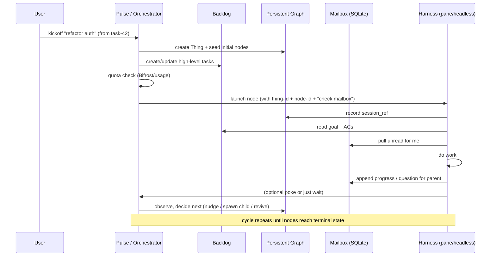

# alt/ — Alternative Architecture & Persistent Mental Model

This directory holds the **desired future direction** for nudge: moving from "launch grids of tmux agents + activity babysitting" to a **Thing-centric, persistent, quota-aware orchestration layer**.

`grok_notes.md` is historical (June 2026) and contains useful thinking but is **partially outdated** (e.g. pure file logs vs the SQLite mailbox decision).

## The Fundamental Problems (why alt/ exists)

Current production system (see root `README.md` + `swarm/`) is excellent at:
- Declarative tmux grids via YAML + nudge metadata
- Purely activity-based monitoring (`monitor-bin`)
- Per-pane babysitters that send short/long prompts (with periodic `/clear`)
- Basic status, broadcast, quota scraping, runtime map in `/tmp`

Persistent friction when running real multi-agent work under subscription CLIs:
- Long-lived sessions burn quota extremely fast.
- Context bloat forces crude `/clear` + full re-brief cycles.
- State is only "output happened" vs "what is this agent actually working on?"
- Agent-to-agent coordination is ad-hoc `tmux-send` (fragile, not durable, no history).
- No first-class concept of a **Thing** (a goal with its own DAG of work that can outlive any individual agent session).
- Revival, resumption, and cross-restart continuity are manual and painful.
- Quota management is per-harness scraping, not integrated into orchestration decisions.

## Current Baseline (what ships today)

- One tmux session + windows + panes described in `swarm/*.yaml` (tmuxp-compatible + `nudge.*` extensions).
- `nudge.agent`, `nudge.monitor`, `nudge.babysit` per pane.
- `swarm/cli.py` (init / apply / status / broadcast / babysit apply / quota / av-usage ...).
- Activity monitor (C) → working / idle only. No semantics.
- Babysit workers (see `babysitctl.py` + spec/state files in `/tmp/nudge-swarm/<session>/`) that periodically poke panes.
- Usage via per-agent scrapers in `swarm/usage/*.sh` + optional agentsview integration.
- Self-awareness note written to `/tmp` so agents can discover targets, sockets, and "how to talk to siblings".
- Messages between panes use `tmux-send` (never raw `send-keys`).

This works for small coordinated groups but does not scale to persistent multi-step collaborative work.

## Alt Vision — Core Concepts

A **Thing** is the unit of persistent work:
- A goal + its DAG of nodes (roles: planner, implementer, reviewer...).
- Survives agent deaths, context wipes, machine restarts.
- Has a durable record + communication substrate.
- Quota-aware (via Bifrost or direct usage oracles).

Key pieces:

- **Persistent Record** (`alt/state/things/<thing-id>/`): nodes/edges + rich child props at creation time (agent, model, prompt, native session_id, pid, ...). `session_ref` captured at launch. Recent blocker: reliably extracting native session IDs from TUI launches (see TASK-12). Children are immutable snapshots — new prompt on reused session = new child node.

- **Backlog** (existing `backlog/` tool): the *human-visible, auditable, high-level* published view of the DAG. Tasks/subtasks map to (or summarize) graph nodes. Agents read it with the `backlog` CLI.

- **Mailboxes** (see recent DECISION-1): durable, append-only communication. Currently leaning toward **per-Thing SQLite** (`comms.db` with `messages` + `subscription_cursors` tables) so agents can cleanly pull "new for me" without managing offsets in context. Directed (sender → recipient). Any pair that has an edge (or is explicitly allowed) can communicate.

- **Poke / Live Transport**: the "wake up now" signal layered on top of the durable mailbox.
  - For tmux panes: short `tmux-send` saying "new mail for this Thing in your inbox — read latest".
  - For headless: equivalent (stdin, control file, or harness resume).
  - The real payload lives in the mailbox (durable, grepable, survives clears/restarts).

- **Pulse** (the metaswarm supervisor / central babysitter): lightweight loop that:
  - Wakes on timer or events (backlog changes, etc.).
  - Consults graph + backlog + quota headroom.
  - Decides for each node: nudge living child, revive using existing ref + fresh context, or spawn brand new.
  - Updates the record.

- Harnesses become **disposable workers**.
  Per-provider best effort (no universal clean pattern):
  - **claude**: supports `--session-id <uuid>` at launch → generate and pass it (cleanest).
  - **codex**: prints `session id: ...` in the exec banner → parse it.
  - **grok**: newest subdir under `~/.grok/sessions/<cwd-encoded>/` right after launch.
  - **agy**: newest `session-*` file under ~/.gemini/tmp or ~/.cache right after launch.

  Record the SID we actually obtained so the node can be resumed later via the provider's native mechanism.

See `alt/bin/launch-child.sh`.

In every case we record the SID we actually got for that node so we can resume/fork it later.

Single event log idea (per-Thing): append-only events for both creation (`node_created` with full props) and comms (`msg` from/to/payload). Replay to build graph + history. SQLite mailboxes (per DECISION-1) can layer on top for cursor-based pulls.

This lets us treat long sessions as optional and revival as first-class.

## How We Will USE It — Concrete Mechanics

### Mermaid Overview: Thing Lifecycle (high level)



### Kick off a task — step by step (current vs desired)

**User intention:** "I want a planner + two implementers + reviewer to work on this backlog task as one coordinated Thing."

**Today (current system):**
1. You edit or create a swarm yaml that describes 4 panes with appropriate agents and babysit specs.
2. `swarm/cli.py apply ...`
3. `swarm/cli.py babysit apply ...`
4. Manually broadcast an initial briefing or use the long_prompt mechanism.
5. Use `tmux-send` or broadcast when you want to tell one pane something.
6. Watch activity lights. Manually intervene when one gets stuck.
7. Quota is separate scraping.

No durable "this group of 4 panes is one Thing" record that survives the tmux session dying.

**Desired alt flow:**
1. User (or trigger) says "start Thing for task-42".
2. System mints `thing-20260618-auth-refactor`.
3. Seeds `graph.json` (planner → impl-A, impl-B → reviewer) + links to backlog task.
4. Pulse (or launch command) does quota-aware node launches:
   - Spawns the right harnesses (can mix current swarm panes + new headless).
   - Each launch command/prompt includes the thing-id + node role + mailbox location.
5. Graph records the live `session_ref`s.
6. Agents are instructed (in their prompt) to use backlog for the goal and their Thing-specific mailbox for directed instructions.
7. All future coordination goes through the durable record + pokes.
8. The swarm yaml / tmux grid can still be used as one possible *deployment* of the nodes, but the identity of the work lives in the Thing.

### Parent wants to give new instructions to a child

1. Parent (human or agent) appends a message row to the mailbox (sender=planner-1, recipient=impl-2, payload=...).
2. Parent (or Pulse) sends a short poke to impl-2's current `session_ref`.
3. impl-2 (on next thinking turn or because of the poke) pulls messages with id > its subscription cursor.
4. Cursor is advanced server-side (in SQLite) so the agent never has to track offsets itself.
5. Agent continues with the new context.

This is far more reliable than hoping the right text is still in the tmux pane's history after a clear or restart.

### Pulse decision example

Pulse sees node "impl-2" is supposed to be active:
- Current ref points to a tmux pane that is still attached → check quota for that client/role.
- Quota ok → send poke "new mail".
- Or: the pane has been dead for 20 min, or weekly quota is exhausted for claude on this sub → decide to spawn a fresh headless `grok -p "..."` (or cheaper model), record the new ref, seed it with recent mailbox + backlog summary + "you are reviving the work of the previous impl-2".

All of this is auditable in the revival_history of the graph node.

### Kick off a new task / Thing

**User does:**
```bash
# Future / aspirational
nudge thing create "Refactor auth per task-42" --from-backlog task-42
# or
python -m nudge kickoff "..." --thing-id thing-20260618-auth
# or manually seed backlog + trigger pulse
```

**What happens:**
1. A `thing-id` is minted (or supplied).
2. An initial `graph.json` is seeded (nodes for planner + impl + review derived from the goal or graphify output).
3. High-level task(s) are created/updated in `backlog/` as the published view.
4. The Pulse (or explicit launch command) looks at ready nodes.
5. For each initial node: quota check → choose harness/profile → launch (tmux pane or headless) with a prompt that contains Thing identity + mailbox location + "read backlog + your inbox".
6. `session_ref` is recorded in the graph.
7. Runtime metadata (if using current swarm tooling) or new alt launch paths are updated.

### A node comes alive and does work

The agent's initial (or re-brief) prompt says something like:

```
You are node "impl-2" (implementer) inside Thing "thing-20260618-auth".
- Goal and acceptance criteria live in the backlog (use `backlog task ...`).
- Your durable inbox for this Thing: alt/state/things/thing-20260618-auth/comms.db (or the directed logs).
- At the beginning of work and whenever you receive a poke, pull new messages addressed to you.
- Post progress, questions, artifacts, and status back through the appropriate channel (mailbox or backlog update).
- Stay responsive to your parent until the parent marks this node complete.
```

Agent:
- Reads backlog for current state.
- Pulls unread from its subscription cursor in the mailbox.
- Works.
- When it has output or a question for parent/sibling: appends to the right mailbox + optionally pokes the recipient + updates backlog if this is a tracked task.

### Coordination & "new mail"

- Parent (or Pulse) decides "impl-2 needs the latest spec change".
- Appends the message to the directed record (SQLite row with sender=parent, recipient=impl-2).
- Sends a tiny poke to the live `session_ref` for that node: "New instructions for thing-... in your mailbox. Read now."
- The receiving agent sees the poke (or polls), pulls the new rows since its cursor, and continues.

This replaces "I hope the tmux scrollback still has the full context" with "the truth is in the durable mailbox; the poke just makes you look now."

### Pulse loop (the replacement for distributed babysitters)

Typical cycle:
1. Wake (timer / fs event / explicit `nudge pulse`).
2. Load graph.json + relevant backlog items.
3. For nodes that are supposed to be active:
   - Query quota oracle (Bifrost, agentsview, per-agent `/status`, etc.) for headroom for that role/client.
   - Inspect current `session_ref`:
     - Still alive + good quota profile → poke if needed.
     - Dead or exhausted → decide revive (if the harness supports resuming the ref with new context) vs spawn fresh (new pane / `grok -p ...` etc.).
   - On spawn/revive: pass Thing + node identity + initial/reprime prompt built from graph + recent mailbox + backlog.
   - Update graph with new ref, timestamps, status.
4. Mark completed nodes, trigger children if all parents done.
5. Log / audit the decisions.

Humans mostly interact via backlog (high level) and `swarm/cli.py` status / broadcast (when using the tmux layer) or future `nudge` commands.

### Ending work

- A node writes "done, see X" to its mailbox + marks the backlog task complete (or lets parent do it).
- Pulse observes terminal state → optional cleanup of the live session/pane.
- Parent node (or human) consumes the outputs and either closes the Thing or spawns follow-on nodes.
- The graph.json + backlog + mailbox history remain as the audit trail.

## Data Model Sketch (evolving)

See `graph.json` ideas in historical notes + the SQLite schema in `backlog/decisions/decision-1`.

Rough shape:
- Per-Thing directory under `alt/state/things/<thing-id>/`
- `graph.json` (or db): nodes + edges + live refs + revival history
- `comms.db`: messages + subscription_cursors (per recent decision)
- Optional checkpoints or artifacts

`session_ref` examples: `tmux:nudge:0.3`, `headless:uuid-abc`, `grok-session-123`.

## Current Pieces That Exist in alt/

- This README (the mental model document)
- `scripts/dispatch.sh` — early unified dispatcher sketch
- `config/` examples (bifrost gateway ideas, clawteam-style graph config)
- Historical discussion in `grok_notes.md` (treat as inspiration, not spec)
- Recent decision record on SQLite mailboxes

The production `swarm/` + `babysit*` + monitor bits are the current implementation we are gradually evolving away from (or layering the new concepts on top of).

## Holding the System in Your Head Persistently

The goal of `alt/` is exactly to solve the problem you described.

**Recommended practices:**

1. Treat `alt/README.md` + the latest `graphify-out/GRAPH_REPORT.md` + backlog as the external brain. Read them at the start of deep work.

2. **Model sync ritual** (suggested): At the beginning of a session with me, say "sync model" or just start. I will load the current alt/README + recent decisions + graph summary and either summarize or ask clarifying questions.

3. **Learning / orientation mode**: Explicitly ask:
   - "Walk me through kicking off a task end-to-end"
   - "Quiz me on how mailboxes + pulse interact"
   - "Simulate: parent wants to spawn a reviewer — what are the exact steps?"
   - "What should the initial prompt for a new impl node contain?"

   I can stay in "teach / quiz / simulate" mode as long as you want.

4. Use the graph we just built (`graphify .`) — it surfaces real connections across code, prompts, backlog, and alt/.

5. Add small living artifacts here over time:
   - Mermaid diagrams for the main flows (Pulse cycle, node lifecycle, comms).
   - A one-page "cheat sheet" of the mental model.
   - Concrete examples (a real small Thing graph + mailbox contents).

6. Keep decisions in `backlog/decisions/` and reference them here.

Would you like me to:
- Immediately replace this file with an even more polished version (with diagrams)?
- Add a "mental model sync" section to CLAUDE.md / AGENTS.md so future sessions start here?
- Do a live interactive walkthrough right now ("let's pretend we're kicking off a real task — you tell me what should happen at each branch point")?
- Prototype any small piece (e.g. a tiny pulse loop sketch or mailbox helper)?

This document + the practice of regularly walking the mechanics with me should make the system feel much more "in your head" persistently.